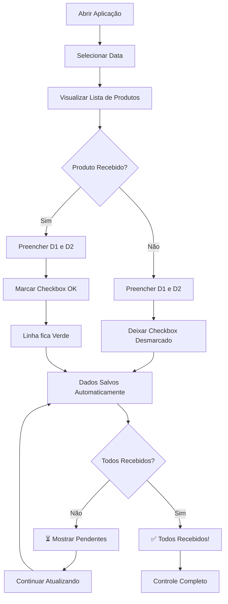

# Controle de Compras - CEASA 🛒

Um aplicação web para mobile com o objetivo de gerenciar e controlar o recebimento de produtos agrícolas do CEASA (Centrais de Abastecimento).Criado com a finalidade de substituir o uso da folha em papel, permitindo o controle, recebimento de mercadorias e status de entrega de múltiplos fornecedores, para o abastecimento  de dois restaurantes. 

##  D1 = Divina 1 (Primeiro restaurante).
##  D2 = Divina 2 (Segundo restaurante).

---

## 📋 Características

- ✅ **Controle de Recebimento**: Marque produtos como recebidos com checkboxes interativas
- 📊 **Comparativo de Quantidades**: Registre quantidades esperadas (D1) e recebidas (D2)
- 📅 **Seleção de Data**: Escolha a data de referência para cada controle
- 💾 **Armazenamento Local**: Todos os dados são salvos automaticamente no navegador usando localStorage
- 🎨 **Interface Responsiva**: Design limpo e intuitivo
- 🏪 **Múltiplos Fornecedores**: Suporte para diferentes galpões/fornecedores
- ⏳ **Status em Tempo Real**: Visualize quantos produtos ainda estão pendentes

---

## 🚀 Como Usar

### 1. **Abrir a Aplicação**
   - Abra o arquivo `index.html` em um navegador web

### 2. **Selecionar Data**
   - Use o campo de data no topo da página para selecionar a data de referência
   - A data é salva automaticamente

### 3. **Registrar Quantidades**
   - Preencha os campos de quantidade:
     - **D 1**: Quantidade solicitada/esperada
     - **D 2**: Quantidade recebida
   - Os dados são salvos automaticamente

### 4. **Marcar Recebimento**
   - Marque o checkbox "OK" quando o produto for recebido
   - A linha mudará de cor (vermelho = pendente, verde = recebido)

### 5. **Monitorar Status**
   - Verifique o status geral na parte inferior
   - A aplicação mostra quantos produtos ainda estão pendentes

---

## � Fluxo de Trabalho



---

## �📁 Estrutura do Projeto

```
Ceasa_1.0/
├── index.html          # Arquivo principal com HTML e estrutura
├── CSS/
│   └── index.css       # Estilos e formatação
├── JS/
│   └── script.js       # Lógica e funcionalidades
└── README.md           # Este arquivo
```

---

## 🛠️ Tecnologias Utilizadas

- **HTML5**: Estrutura semântica e inputs de formulário
- **CSS3**: Estilos responsivos e animações
- **JavaScript (Vanilla)**: Lógica de negócio e gerenciamento de dados
- **localStorage API**: Persistência de dados no navegador

---

## 📦 Produtos Disponíveis

O aplicativo acompanha os seguintes produtos do CEASA:

| Produto | Unidade |
|---------|---------|
| Abacaxi | UND |
| Banana | Cento |
| Banana p/doce | Cento |
| Limão Ciciliano | KG |
| Laranja M | S/25KG |
| Manga Tommy | S/25KG |
| Coco seco | UND |
| Abacate | UND |
| Maracujá | CX/25KG |

*Nota: A lista pode ser expandida editando o arquivo `index.html`*

---

## 💾 Armazenamento de Dados

Os dados são armazenados no **localStorage** do navegador com as seguintes informações:

- **Quantidade D1**: Valor esperado
- **Quantidade D2**: Valor recebido
- **Status de Recebimento**: Booleano (marcado/desmarcado)
- **Data Selecionada**: Data de referência do controle

### Como Limpar os Dados

Para limpar todos os dados salvos, use o console do navegador:

```javascript
localStorage.clear();
```

---

## 🎨 Paleta de Cores

- **Cabeçalho**: Cinza escuro (#434141)
- **Fornecedor**: Bege claro (#f1efef)
- **Recebido**: Verde
- **Pendente**: Vermelho (#cb4c59)
- **Fundo**: Cinza muito claro (#f7f7f7)

---

## 🌐 Requisitos

- Navegador web moderno com suporte a:
  - HTML5
  - CSS3
  - JavaScript ES6+
  - localStorage

**Navegadores Suportados:**
- Chrome 90+
- Firefox 88+
- Safari 14+
- Edge 90+

---

## 🔧 Personalização

### Adicionar Novos Produtos

1. Abra `index.html`
2. Localize a seção `<tbody>` da tabela
3. Adicione uma nova linha:

```html
<tr data-id="10">
  <td>Nome do Produto</td>
  <td>Unidade</td>
  <td><input type="number" class="qtd-input"></td>
  <td><input type="number" class="qtd-input2"></td>
  <td><input type="checkbox" class="check-recebido"></td>
</tr>
```

### Adicionar Novos Fornecedores

1. Abra `index.html`
2. Copie um bloco `<div class="fornecedor">` completo
3. Modifique o atributo `data-fornecedor` e o título `<h3>`
4. Atualize a lista de produtos conforme necessário

---

## 📝 Notas Importantes

- Os dados são salvos **localmente** no navegador (não no servidor)
- Limpar o cache/cookies do navegador pode apagar os dados
- A aplicação funciona **offline** (sem conexão com internet)
- Cada navegador tem seu próprio armazenamento independente

---

## 🐛 Troubleshooting

### Os dados não estão sendo salvos?
- Verifique se o localStorage está habilitado no navegador
- Tente limpar o cache e recarregar a página

### As cores não aparecem corretamente?
- Certifique-se de que o arquivo `CSS/index.css` está no caminho correto
- Recarregue a página (Ctrl+F5)

### Os inputs não funcionam?
- Verifique se o arquivo `JS/script.js` está carregado
- Abra o console do navegador (F12) para ver se há erros

---

## 📞 Suporte

Para dúvidas ou problemas com a aplicação, verifique os arquivos e console do navegador para mensagens de erro.

---

## 📄 Licença

Este projeto é fornecido como está, para uso em gerenciamento de compras do CEASA.

---

## 🎯 Versão

**Versão:** 1.0  
**Última atualização:** Janeiro de 2026

---

**Desenvolvido para otimizar o controle de recebimento de produtos agrícolas! 🌾**

Create by me Wilson Carlos!!
